バックエンド勉強会 2 日目

# Firebaseで

# SNSを作ってみよう

### 〜 投稿編 〜

---

# 自己紹介

## 矢部大智

<div style="display: flex; align-items: center; gap: 40px;">
<div>

- **出身**: 福井県
- **所属**: コンピュータシステム専攻 2 年生
- **技術領域**: TypeScript, Kotlin, Go, AWS
- **趣味**: 絶叫系, ゲーム, 食べること
  

---

## 今日のゴール

- バックエンド/フロントエンドとは何か分かる
- Firebaseで何ができるか分かる
- webアプリ開発がなんとなくわかるようになる
- 「これなら作れそう」と思えるようになる

---

## バックエンドとは

YouTubeで例えると…

- **バックエンド**
  - 動画を保存している
  - 「この動画ください」というリクエストを受け取る
  - 動画データを送り返す

- **フロントエンド**
  - 再生ボタンを表示する
  - 「この動画欲しい」というリクエストを送る
  - 動画を再生する
  - コメントやいいねを表示する

---

## マクドナルドで例えると

- **バックエンド** = 厨房（ハンバーガーを作る）
- **フロントエンド** = カウンター（お会計・注文を受ける・商品の受け渡し）

厨房がないとハンバーガーは出てこない。
カウンターがないとハンバーガーを購入できない。

---

## 普通に作ろうとすると…

- サーバー構築
- 認証
- API実装
- セキュリティ

👉**初心者にはハードルが高い**

---

## Firebaseとは？

Googleが提供する  
**「アプリ開発に必要なもの全部入り」サービス**

特徴：

- バックエンド開発のめんどくさいところは全部Googleが用意してくれてる
  - サーバー管理不要
  - フロントエンド中心で開発できる

---

## Firebaseでできること

- 🔐Authentication（ログインのための認証機能）
- Firestore / Realtime DB（データ保存）
- Storage（画像や動画などのファイルを保存）
- etc...

**SNSに必要な機能全部ある**

---

## 今回使うFirebase機能

今回の勉強会では👇

- 1日目: Authentication（ログイン）
- 2日目: Firestore（投稿データ）

---

## アプリ完成イメージ

---

## 今回使うファイルのダウンロード

- 以下のURLからダウンロードできます
- 今日が初めての人はダウンロードしてください
  https://github.com/nrak126/firebase-tutorial/archive/refs/heads/main.zip

---

- vscodeで開き、ターミナルで以下の三つのコマンドを実行

```
cd before
```

```
npm run dev
```

#### ※1日目参加してない人↓

```
cd before-day2
```

```
npm i
```

```
npm run dev
```

- サーバーが立ち上がったらhttp://localhost:5173/ にアクセス

---

## 1日目参加してない人向け

---

## firebaseプロジェクトの作成

- firebase のURL
  https://firebase.google.com/?hl=ja
- ログインした後コンソールへ移動
  

---

- firebaseプロジェクトを設定して開始をクリック


---

- プロジェクト名を入力して続行


---

- AIアシスタントは今回使わないのでどちらでも


---

- アナリティクスはオフでプロジェクトを作成


---

- アプリを追加 → ウェブを選択


---

- アプリのニックネームを入力してアプリを登録


---

- このコードをコピー

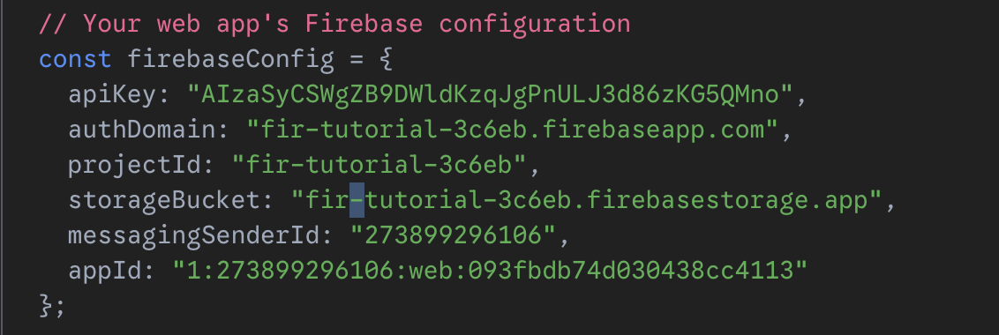

---

- .envファイルの各変数に代入

これを
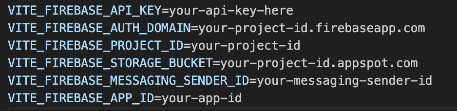

こう↓

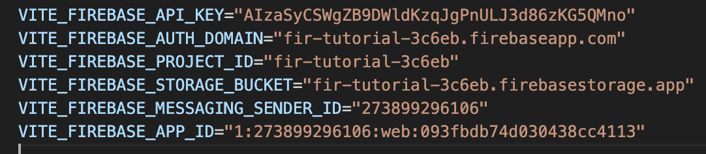

- 貼り付け終わったらコンソールに進む

---

### ログイン機能のための設定

- 左側にある「構築」の中の「Authentication」をクリック


---

- 始めるをクリック


---

- Googleを選択


---

- 有効にするスイッチをオンにする
- サポートメールを追加して保存をクリック


---

## 投稿機能の実装

---

## Q. SNSの一つの投稿にはどのうな情報が入っているべき？

---

## Q. SNSの一つの投稿にはどのうな情報が入っているべき？

#### A. ユーザー名、ユーザーアイコン、投稿の内容、投稿時刻、ユーザーの一意なID

---

- content: 投稿内容
- author: 投稿者の名前
- authorId: 投稿者のID
- photoURL: アイコンURL
- timestamp: 投稿時刻

---

## firestoreの構築

- 「構築」のfirestore databaseを選択
  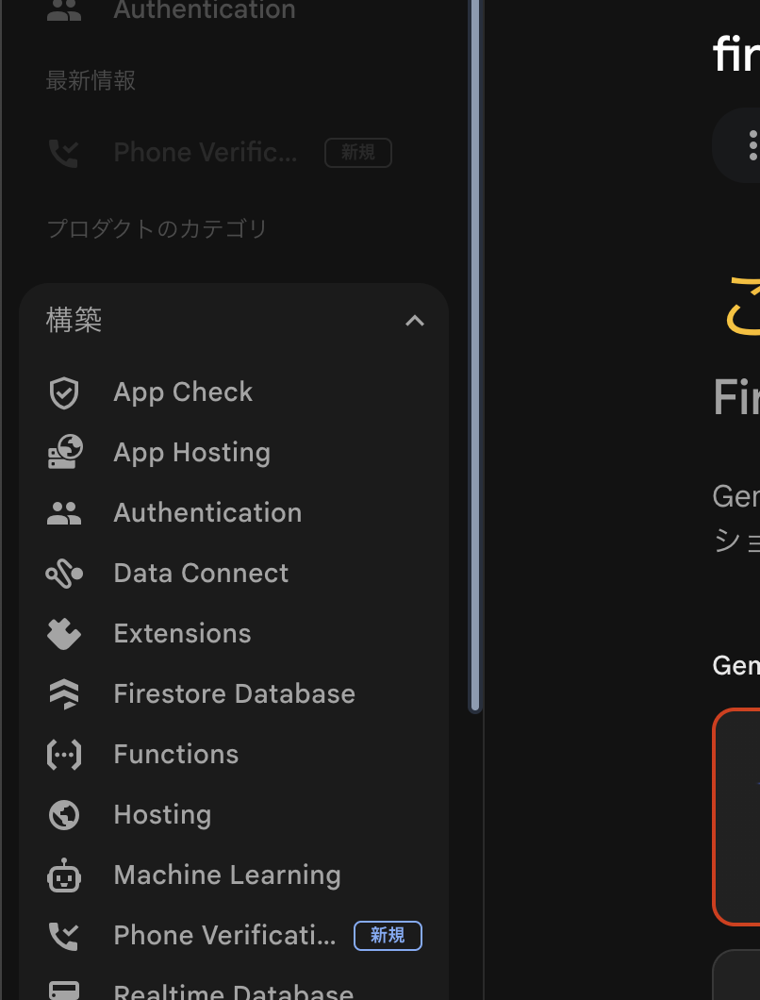

---

- データベースの作成をクリック
  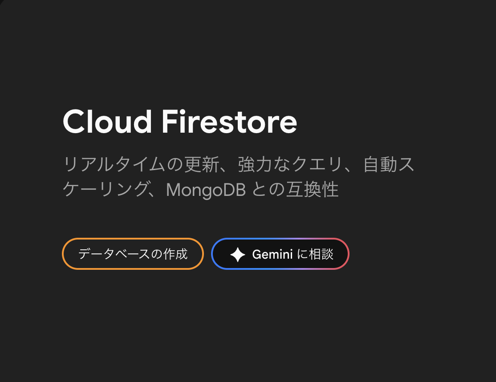

---

- エディションはstandardのまま次へ
  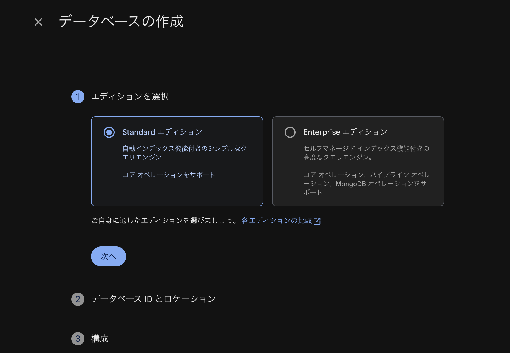

---

- ロケーションをtokyoにして次へ
  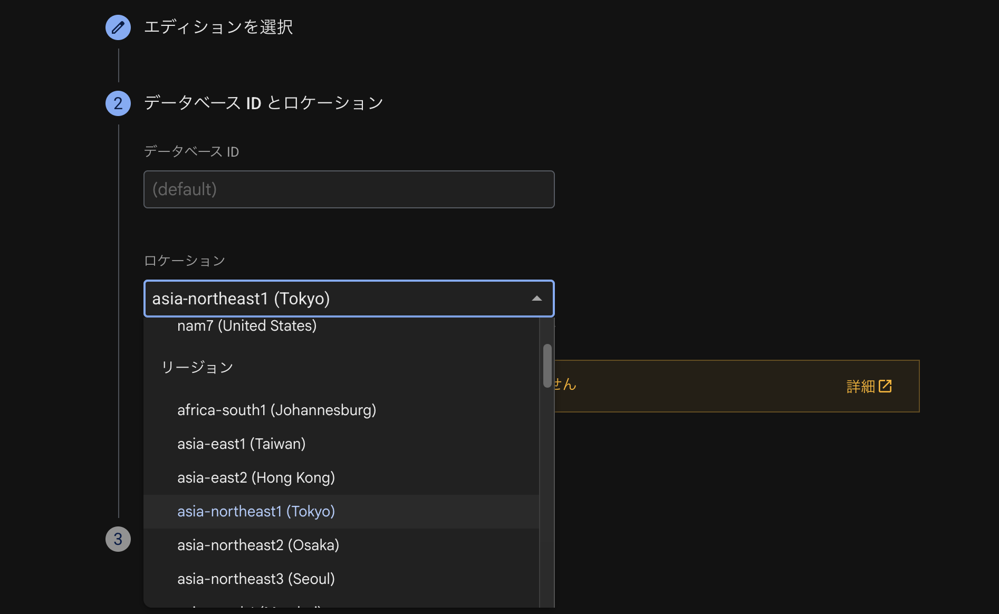

---

- 今回はテストモードで開始
- 作成をクリック
  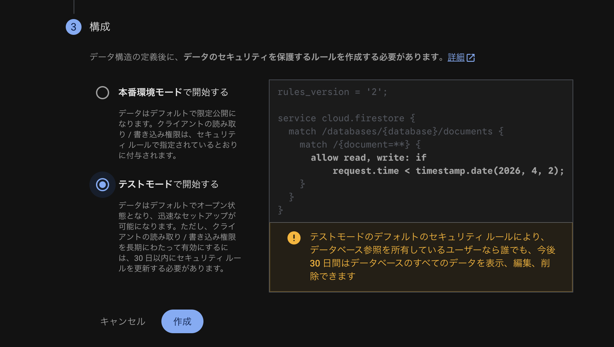

---

- firestoreの設定完了
  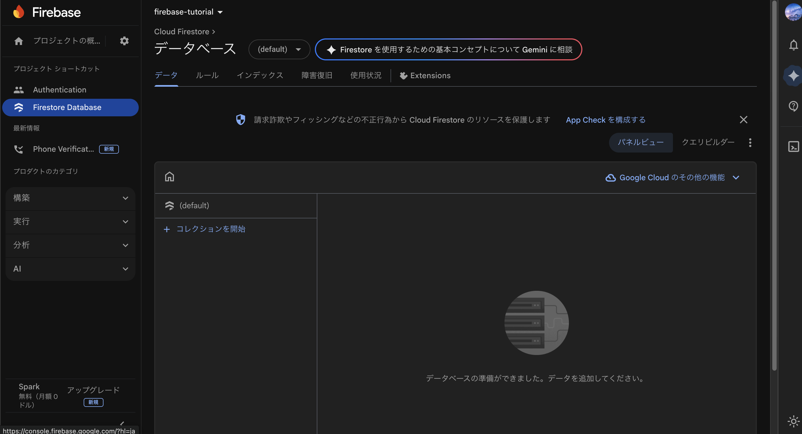

---

#### firebase.jsを編集
  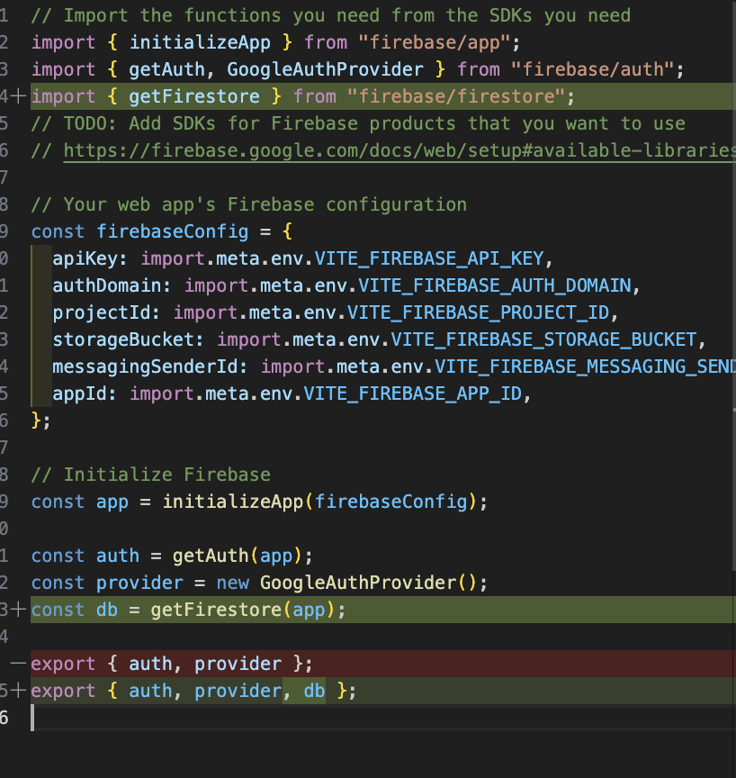


---

#### firebase.jsを編集
```js
import { getFirestore } from "firebase/firestore";
```
```js
const db = getFirestore(app);
export { auth, provider, db };
```

---

#### App.jsxにimport文を追加
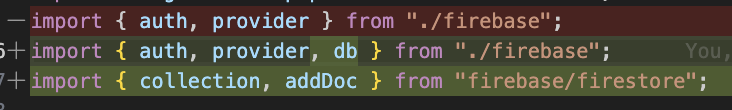
```js
import { auth, provider, db } from "./firebase";
import { collection, addDoc } from "firebase/firestore";
```

---

#### App.jsxの`handlePost`関数を以下のように変更

```js
const handlePost = async (content) => {
  if (!currentUser) return;

  const postsRef = collection(db, "posts");
  await addDoc(postsRef, {
    content: content,
    author: currentUser.displayName,
    authorId: currentUser.uid,
    photoURL: currentUser.photoURL,
    timestamp: new Date().toISOString(),
  });
};
```

---

### 投稿するとちゃんとfirestoreに反映されるか確認

---

## 投稿の取得機能

---

#### App,jsxにimportの追加
```js
import { collection, addDoc, getDocs, orderBy, query } from "firebase/firestore";
```


---

#### `fetchPost`関数を追加

```js
  const fetchPosts = async () => {
    const postsRef = collection(db, "posts");
    const q = query(postsRef, orderBy("timestamp", "desc"));
    const snapshot = await getDocs(q);
    const postsData = snapshot.docs.map((doc) => ({
      id: doc.id,
      ...doc.data(),
    }));
    setPosts(postsData);
  };
```
