# Firebaseで

# SNSを作ってみよう

### 〜 BaaSを活用したWebアプリ開発 〜

---

# 自己紹介

## 矢部大智

<div style="display: flex; align-items: center; gap: 40px;">
<div>

- **出身**: 福井県
- **所属**: コンピュータシステム専攻 2 年生
- **技術領域**: TypeScript, Kotlin, Go, AWS
- **趣味**: 絶叫系, ゲーム, 食べること
  

---

## 今日のゴール

- バックエンド/フロントエンドとは何か分かる
- Firebaseで何ができるか分かる
- webアプリ開発がなんとなくわかるようになる
- 「これなら作れそう」と思えるようになる

---

## バックエンドとは

YouTubeで例えると…

- **バックエンド**
  - 動画を保存している
  - 「この動画ください」というリクエストを受け取る
  - 動画データを送り返す

- **フロントエンド**
  - 再生ボタンを表示する
  - 「この動画欲しい」というリクエストを送る
  - 動画を再生する
  - コメントやいいねを表示する

---

## マクドナルドで例えると

- **バックエンド** = 厨房（ハンバーガーを作る）
- **フロントエンド** = カウンター（お会計・注文を受ける・商品の受け渡し）

厨房がないとハンバーガーは出てこない。
カウンターがないとハンバーガーを購入できない。

---

## SNSアプリにはどんな機能がある？

- ユーザー登録・ログイン
- 投稿
- タイムライン表示
- いいね・コメント

---

## 普通に作ろうとすると…

- サーバー構築
- 認証
- API実装
- セキュリティ

👉**初心者にはハードルが高い**

---

## Firebaseとは？

Googleが提供する  
**「アプリ開発に必要なもの全部入り」サービス**

特徴：

- バックエンド開発のめんどくさいところは全部Googleが用意してくれてる
  - サーバー管理不要
  - フロントエンド中心で開発できる

---

## Firebaseでできること

- 🔐Authentication（ログインのための認証機能）
- Firestore / Realtime DB（データ保存）
- Storage（画像や動画などのファイルを保存）
- etc...

**SNSに必要な機能全部ある**

---

## 今回使うFirebase機能

今回の勉強会では👇

- Authentication（ログイン）
- Firestore（投稿データ）

---

## アプリ完成イメージ

---

## 今回使うファイルのダウンロード

- 以下のURLからダウンロードできます
- ダウンロードが終わったらvscodeで開いてください。
  https://github.com/nrak126/firebase-tutorial/archive/refs/heads/main.zip

---

- vscodeのターミナルで以下の三つのコマンドを実行

```
cd before
```

```
npm i
```

```
npm run dev
```

- サーバーが立ち上がったらhttp://localhost:5173/ にアクセス

---

## firebaseプロジェクトの作成

- firebase のURL
  https://firebase.google.com/?hl=ja
- ログインした後コンソールへ移動
  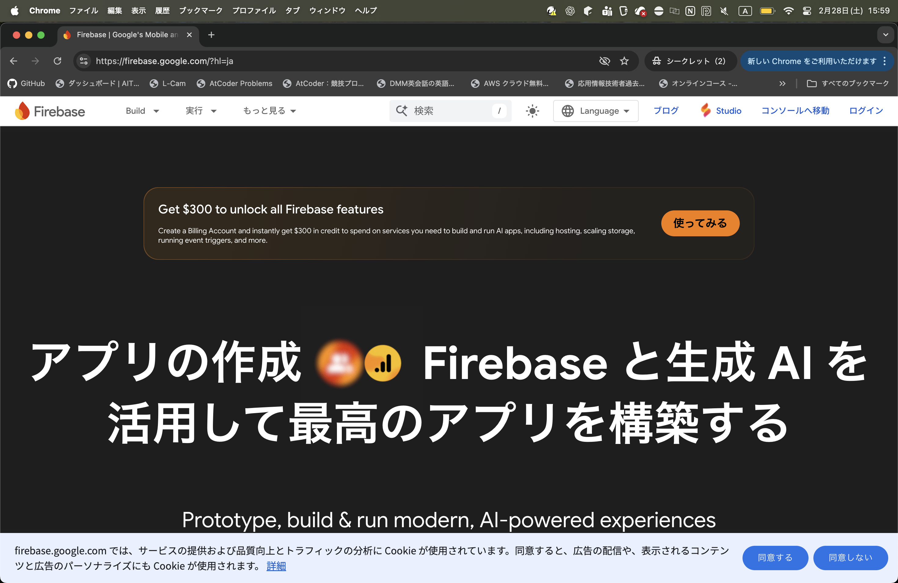

---

- firebaseプロジェクトを設定して開始をクリック

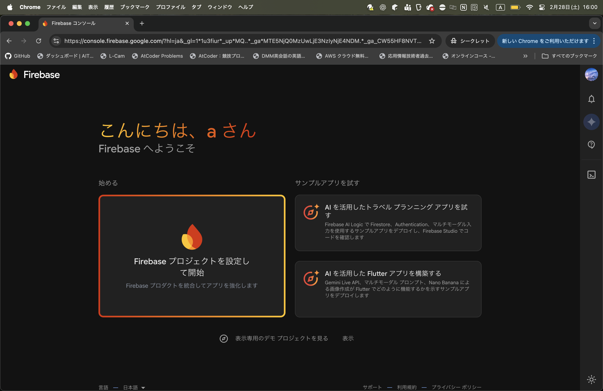

---

- プロジェクト名を入力して続行

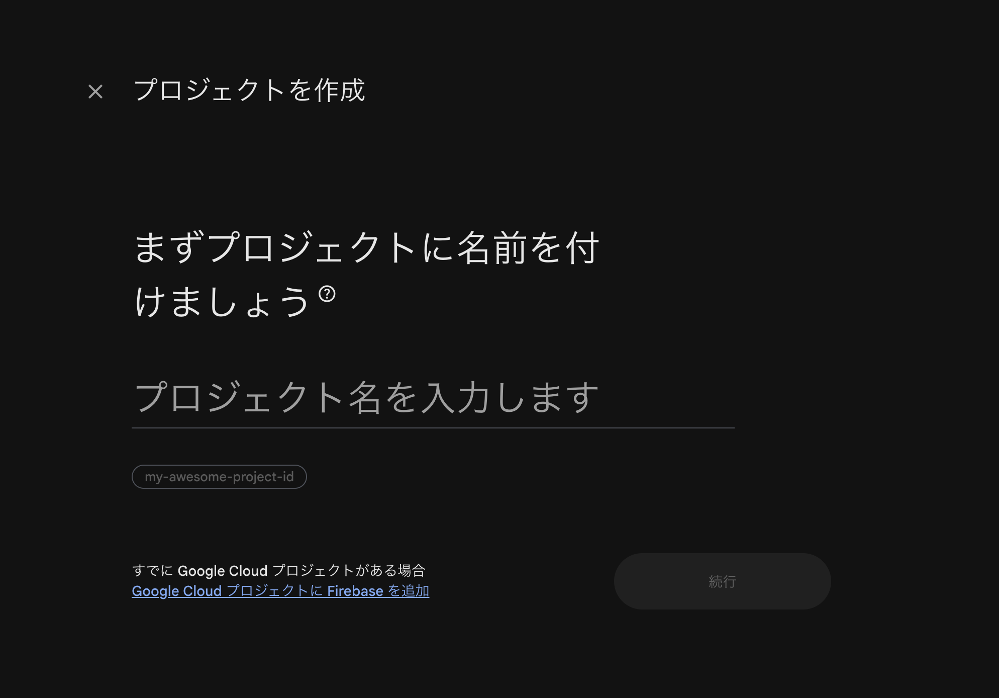

---

- AIアシスタントは今回使わないのでどちらでも

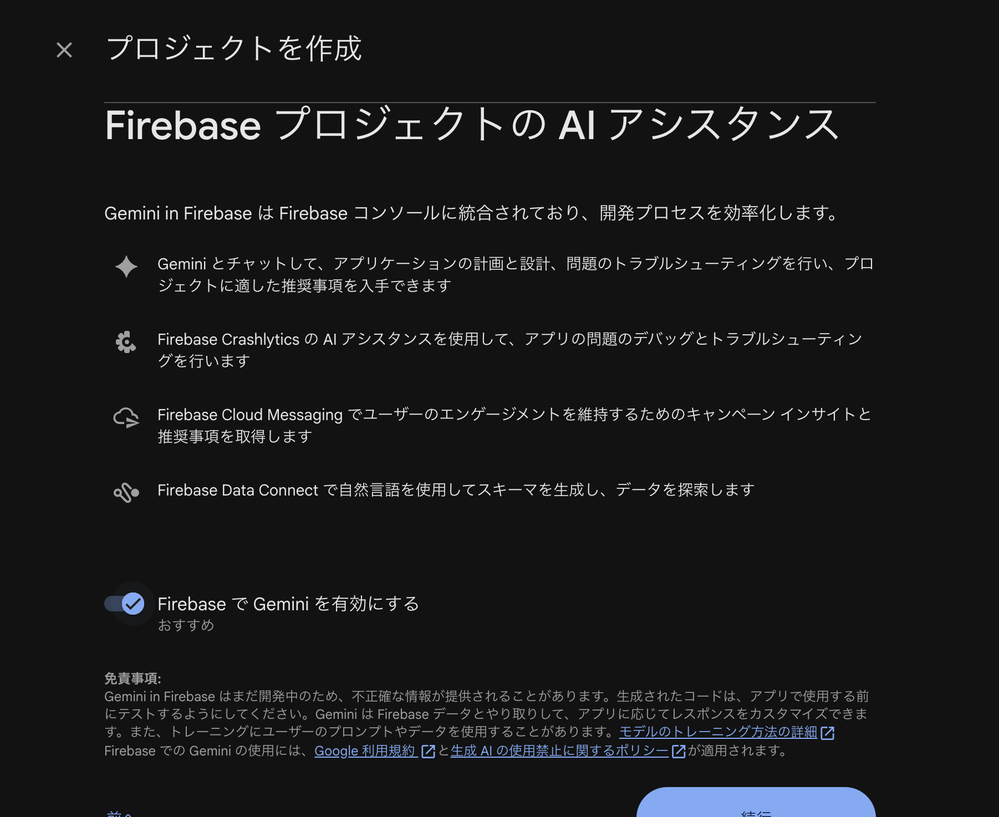

---

- アナリティクスはオフでプロジェクトを作成

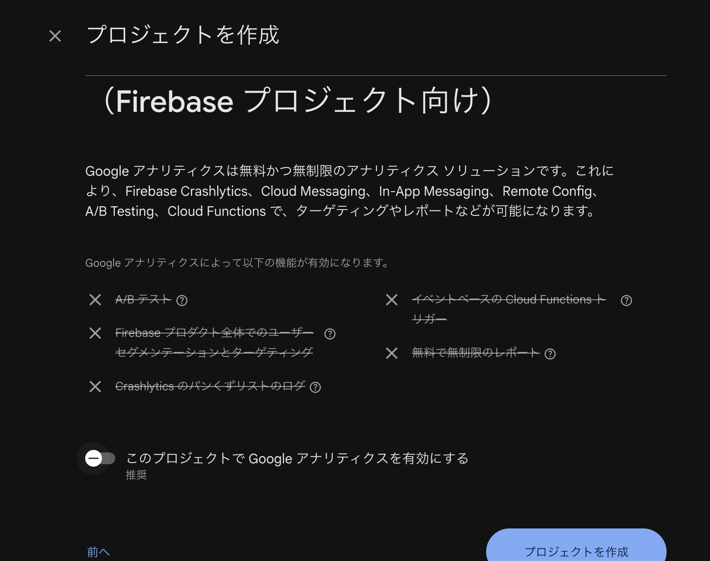

---

- アプリを追加 → ウェブを選択

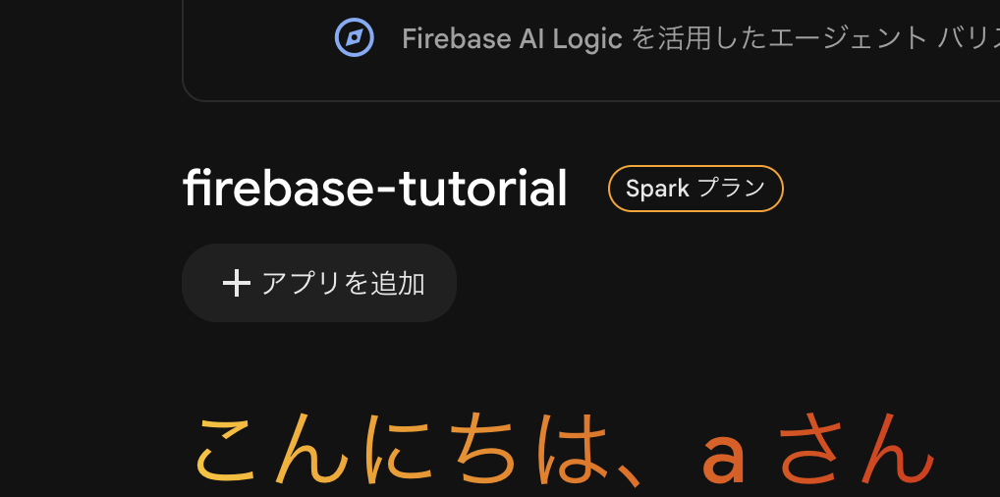
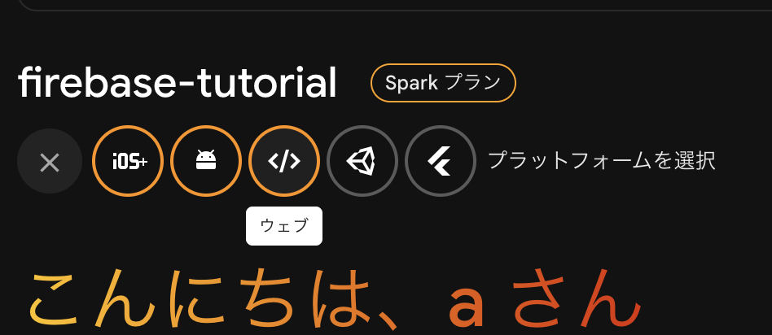

---

- アプリのニックネームを入力してアプリを登録

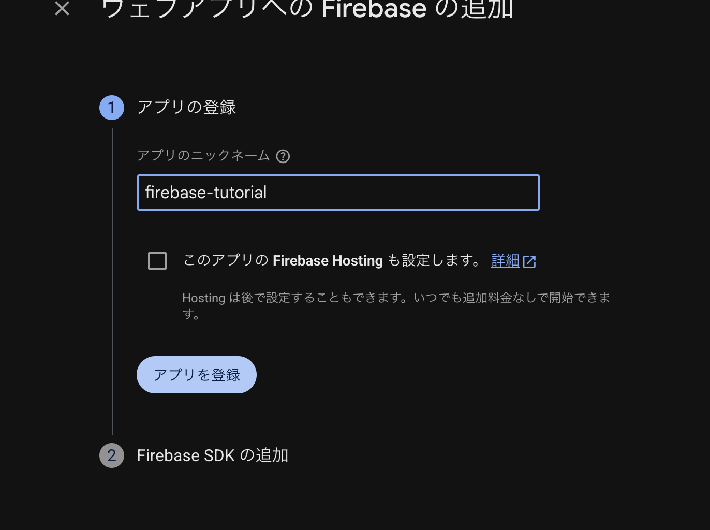

---

- `npm install firebase`をコピー

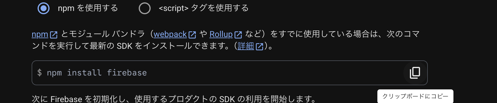

- vscodeにのターミナルに貼り付けて実行

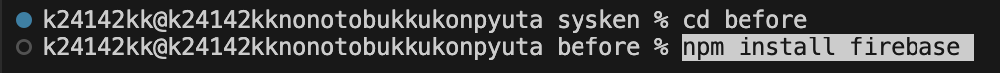

---

- このコードをコピー

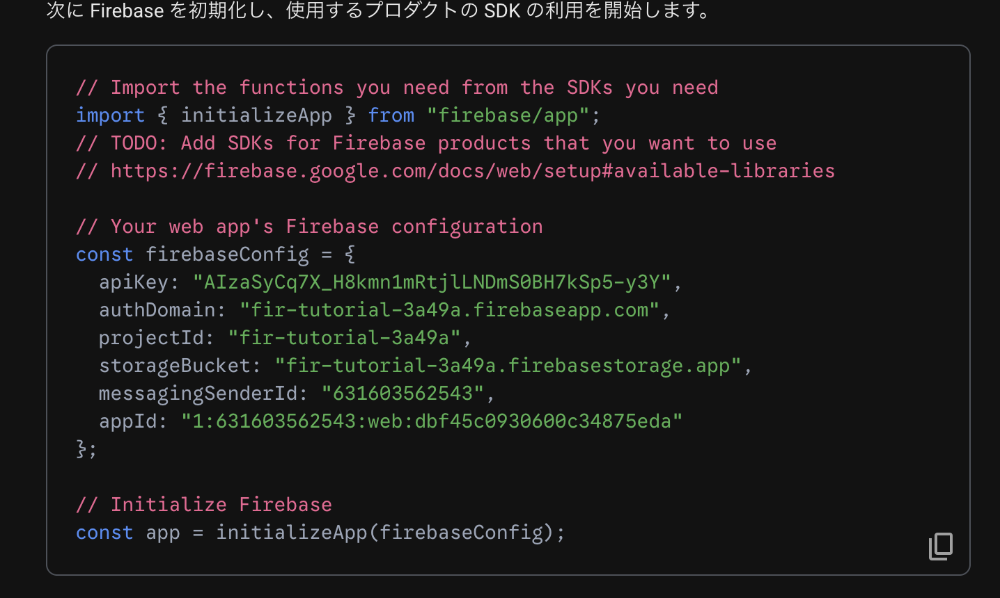

- firebase.jsの中に貼り付け

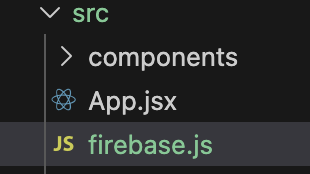

- 貼り付け終わったらコンソールに進む

---

### ログイン機能のための設定

- 左側にある「構築」の中の「Authentication」をクリック

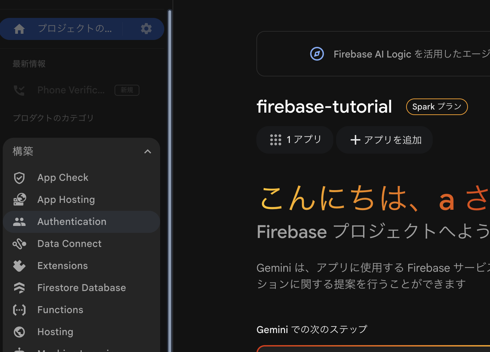

---

- 始めるをクリック

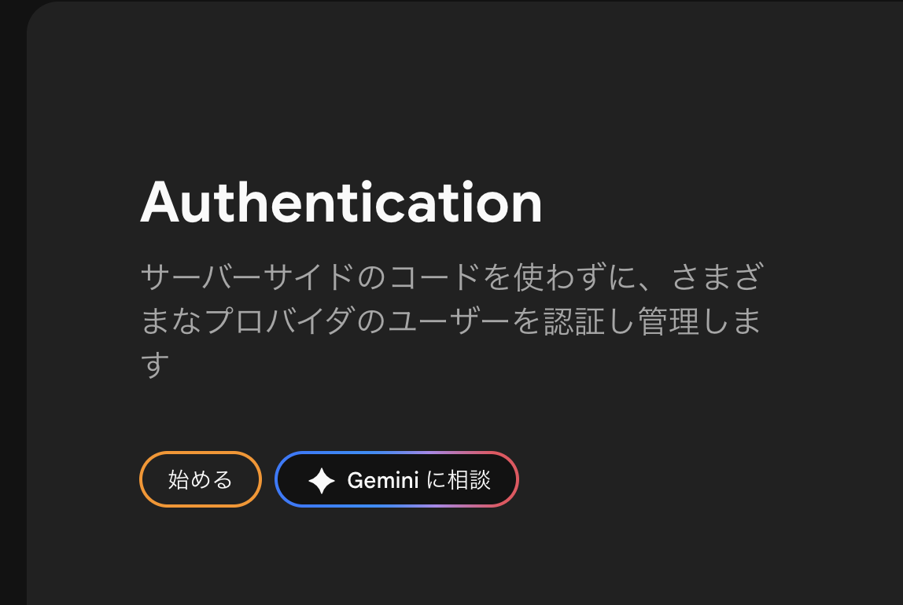

---

- Googleを選択

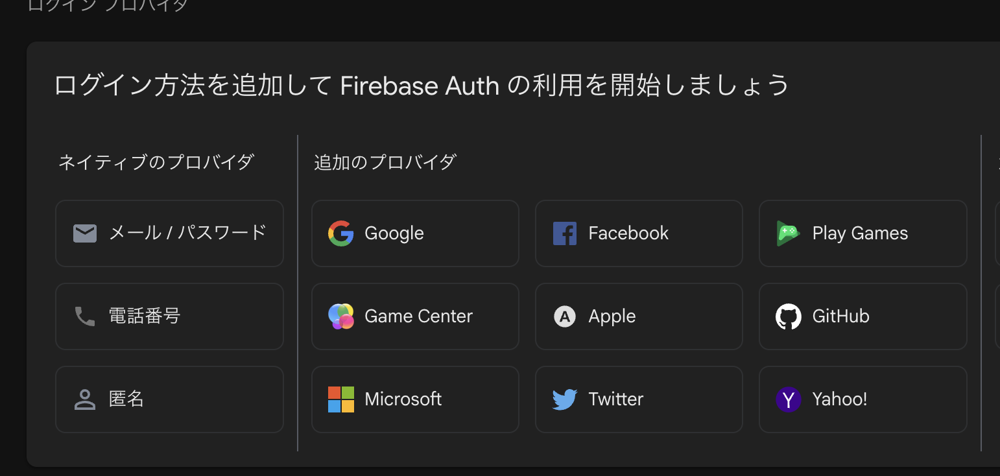

---

- 有効にするスイッチをオンにする
- サポートメールを追加して保存をクリック

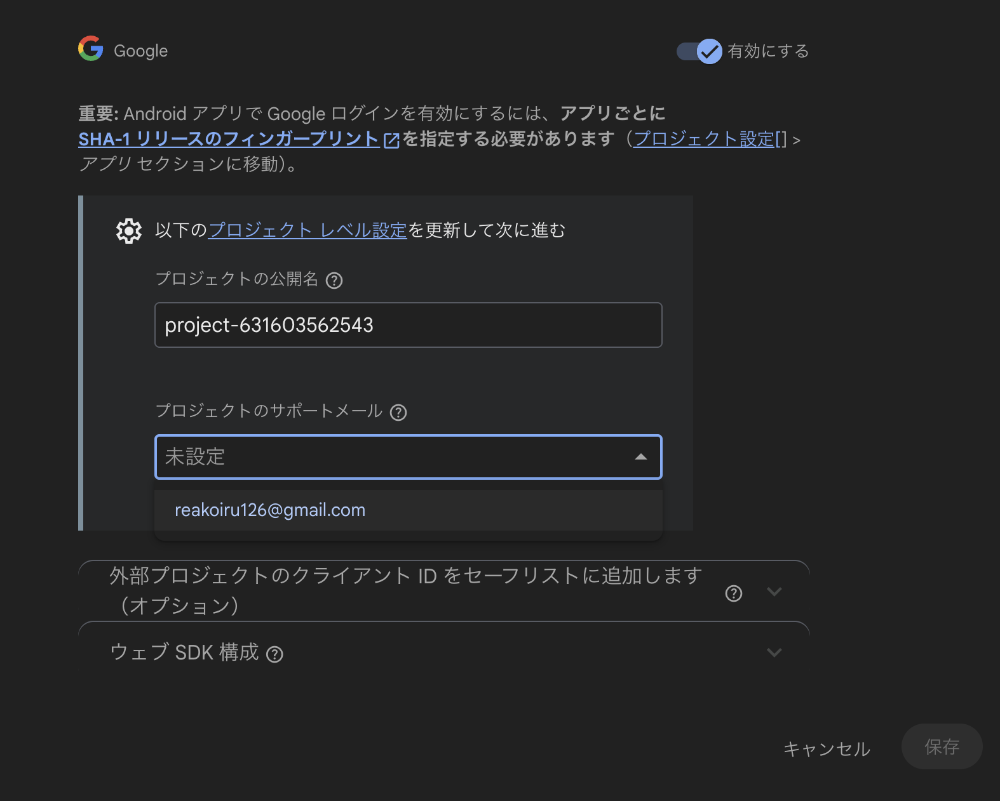

---

- firebase.jsにコードを追加

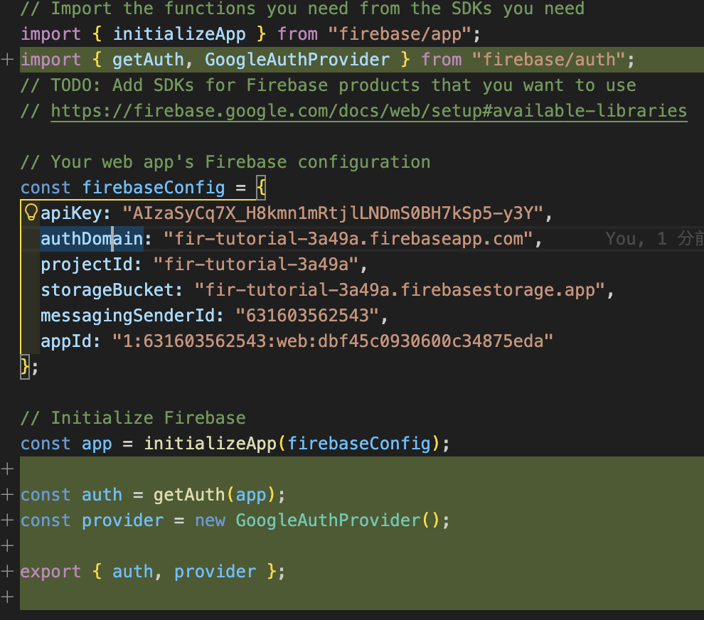

---

```js
import { getAuth, GoogleAuthProvider } from "firebase/auth";
```

```js
const auth = getAuth(app);
const provider = new GoogleAuthProvider();

export { auth, provider };
```

---

- app.jsxに移動
- import文を追加

```js
import { signInWithPopup } from "firebase/auth";
import { auth, provider, db } from "./firebase/config";
```

---

- app.jsxの`handleLogin`関数を以下をコピーして差し替え

```js
const handleLogin = () => {
  signInWithPopup(auth, provider).then((result) => {
    setCurrentUser(result.user);
  });
};
```

---

- app.jsxの下の方へ移動
- この2行を修正
  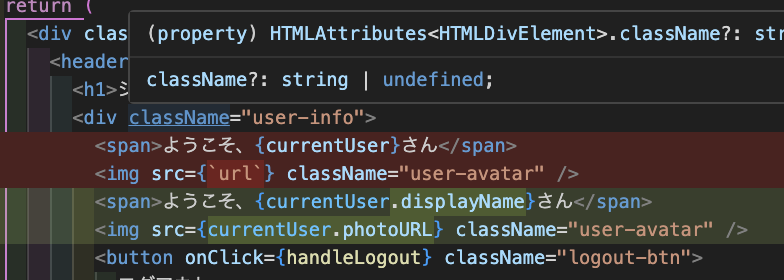

```jsx
<span>ようこそ、{currentUser.displayName}さん</span>

```
